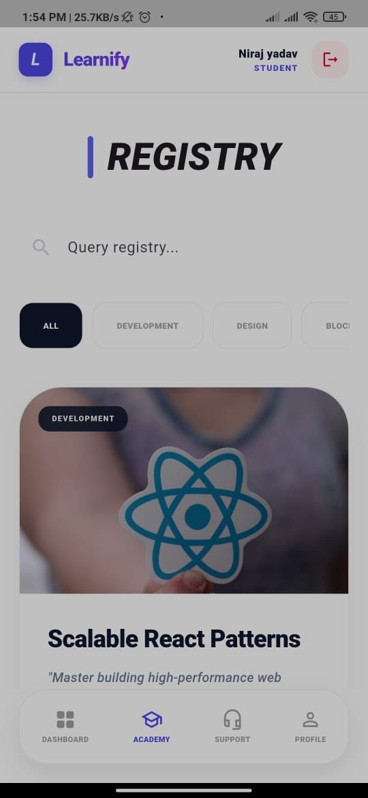
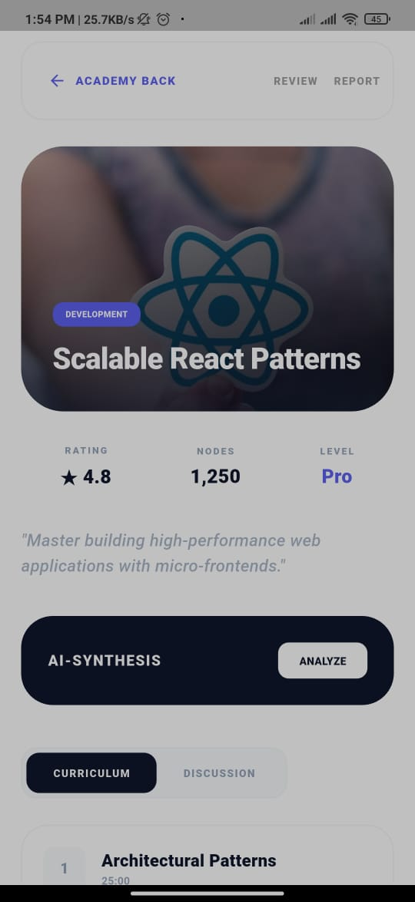

# Learnify 🎓
Learnify is a modern Flutter application for high-density academic learning. It features a sleek "Neural Architect" design, Firebase authentication, and a dynamic course registry.

## 📱 Screenshots
<p align="center">
  
  
  
  
  
</p>

## ✨ Features
- **Firebase Authentication:** Secure Login and Sign-up.
- **Neural Dashboard:** Animated pulse graphics and daily protocols.
- **Course Registry:** High-fidelity course cards with search and category filtering.
- **Persistent Login:** Stay logged in even after closing the app.

## 🚀 Tech Stack
- **Frontend:** Flutter (Dart)
- **Backend:** Firebase Auth & Cloud Firestore
- **State Management:** StatefulWidget / Streams

## 🛠️ Installation
1. Clone the repository:
   ```bash
   git clone https://github.com/nirajaj/Team6-Excelerate-Project.git

2. Install dependencies:
   ```bash
   flutter pub get


3. Run the app:
   ```bash
   flutter run