# Learnify - Elite Governance & Academic Registry 🎓

Learnify is a high-performance Learning Management System (LMS) built with **Flutter** and **Firebase**. It features a "Neural Architect" design, live global data integration via the **Wikipedia REST API**, and a comprehensive administrative governance suite.

---

## 📱 Interface Gallery

### 👤 Learner Terminal (Student Experience)
*From secure entry to high-density academic study.*

<p align="center">
  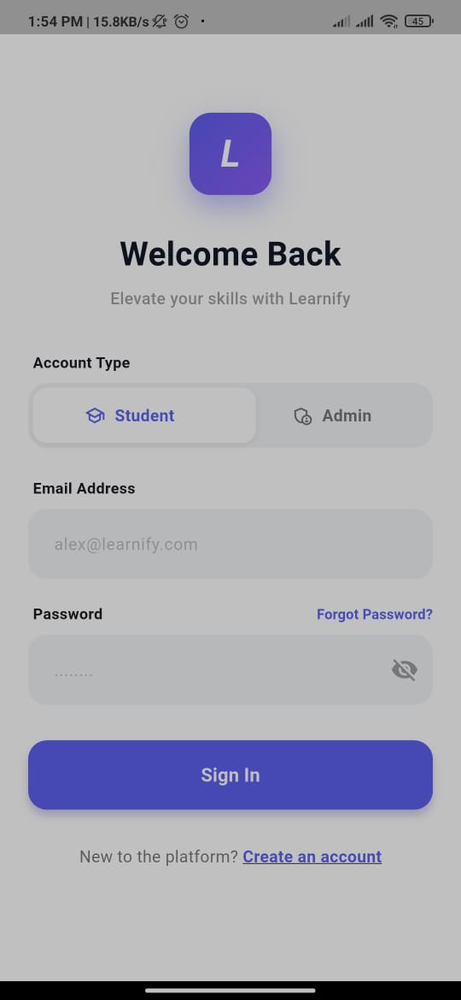
  
  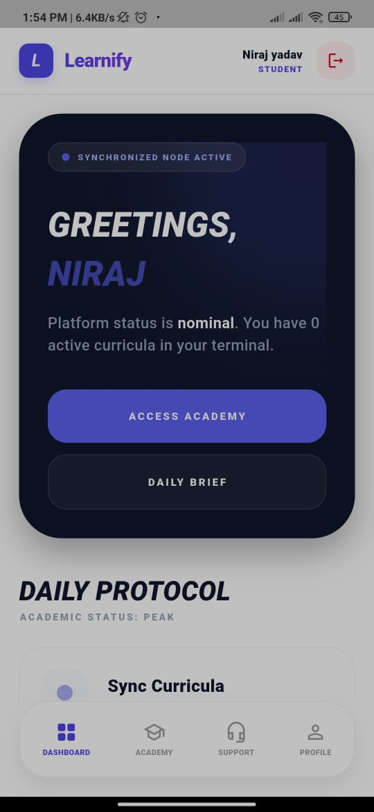
</p>
<p align="center">
  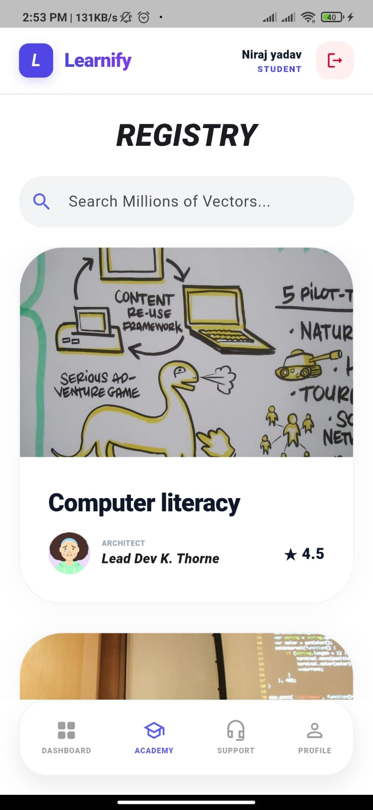
  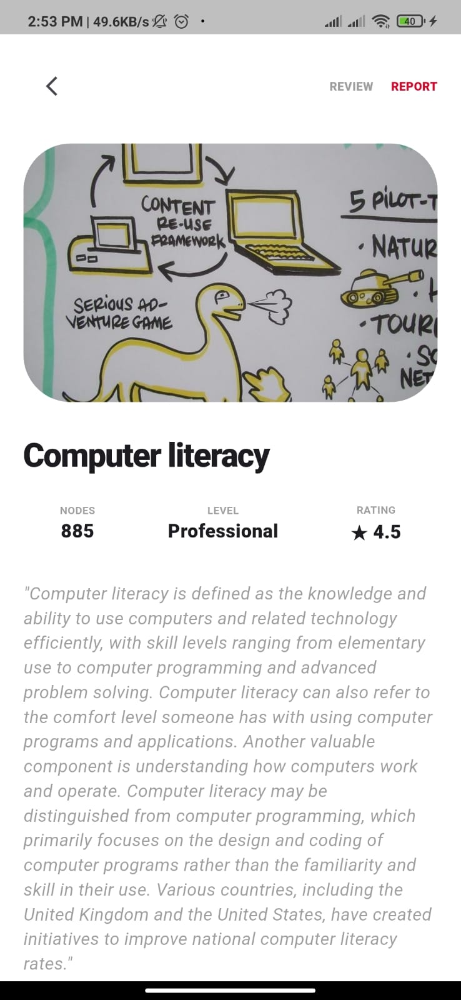
  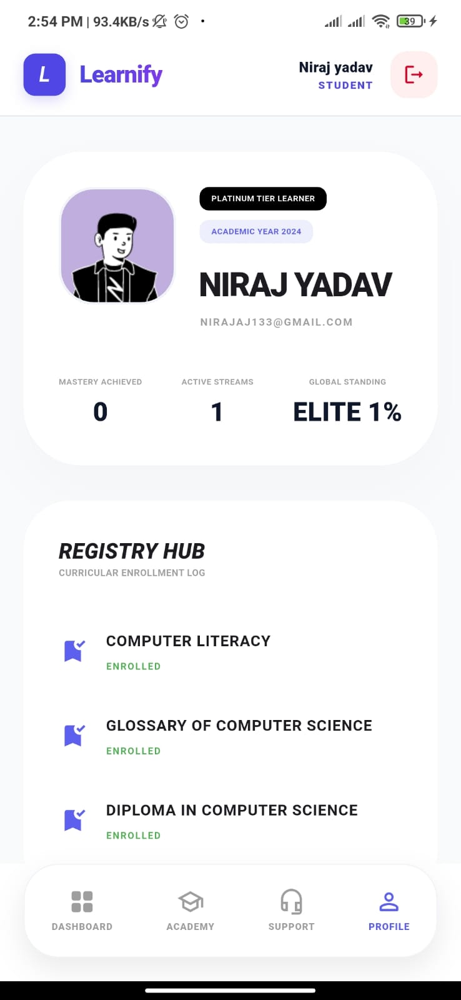
</p>
<p align="center">
  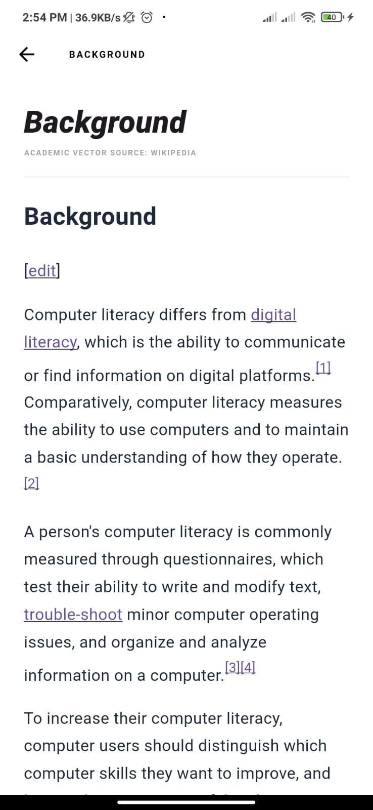
  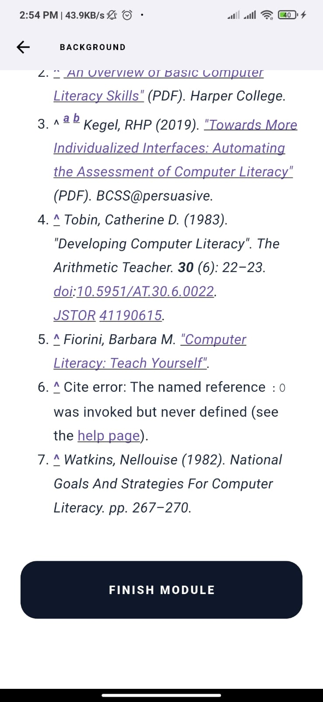
  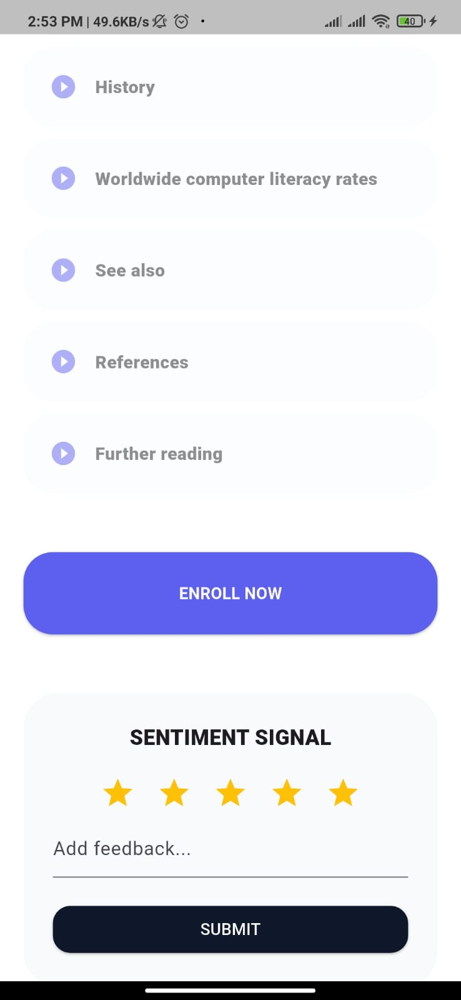
</p>
<p align="center">
  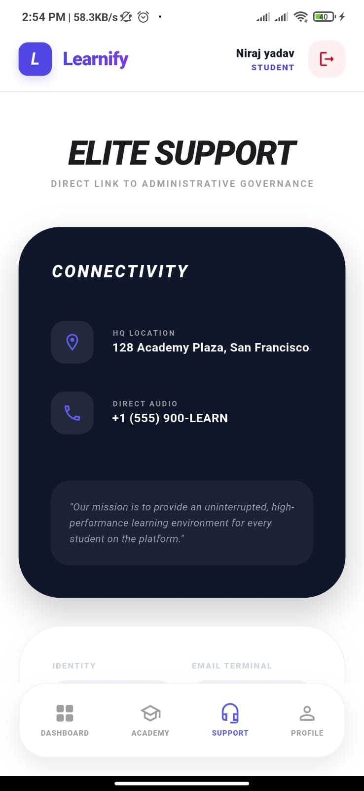
  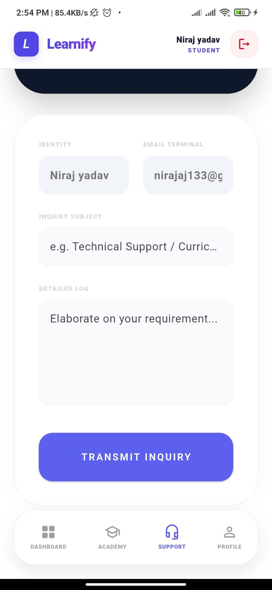
</p>

### 🏛️ Elite Governance (Administrative Suite)
*Total platform control, moderation, and security logging.*

<p align="center">
  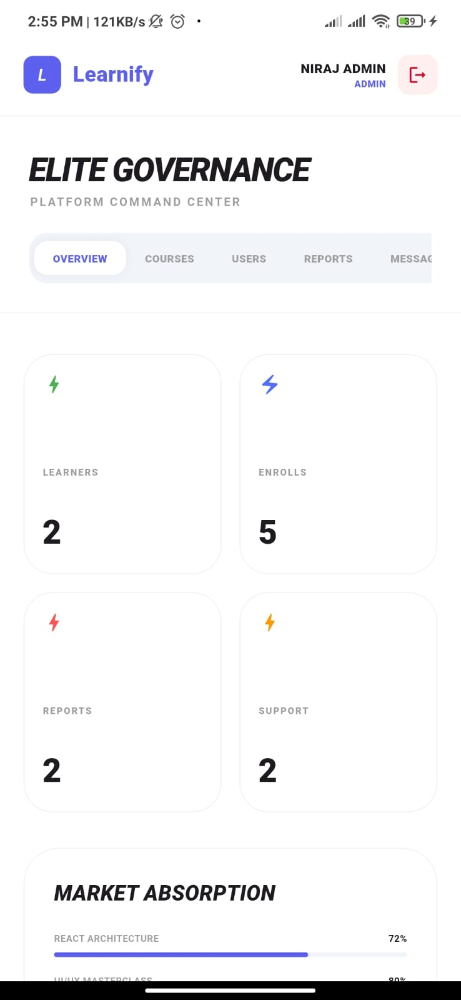
  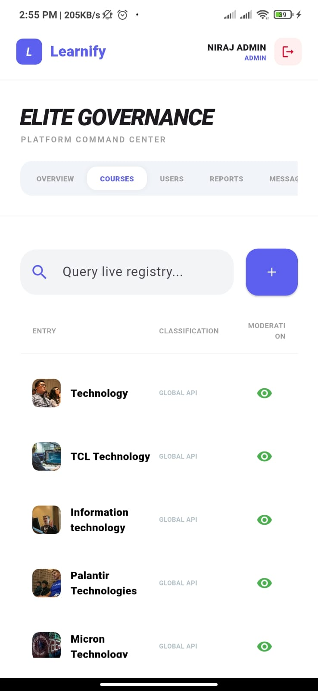
</p>
<p align="center">
  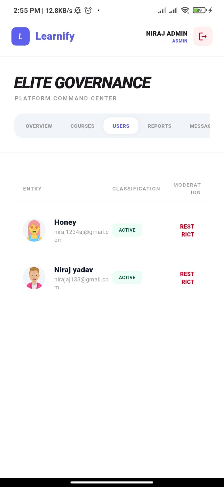
  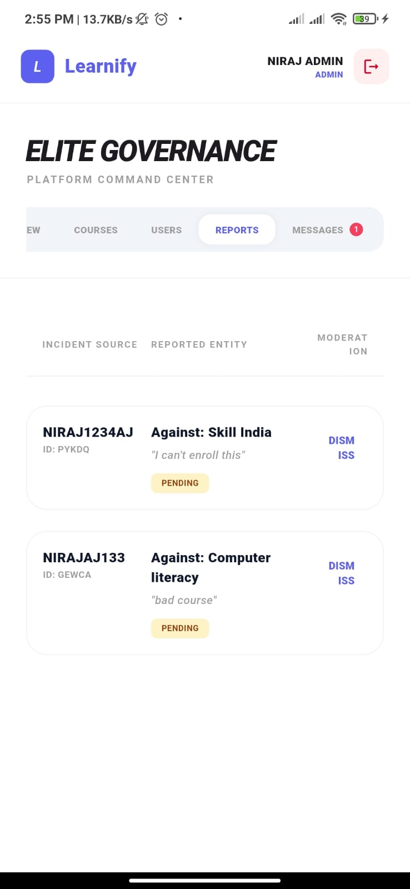
</p>
<p align="center">
  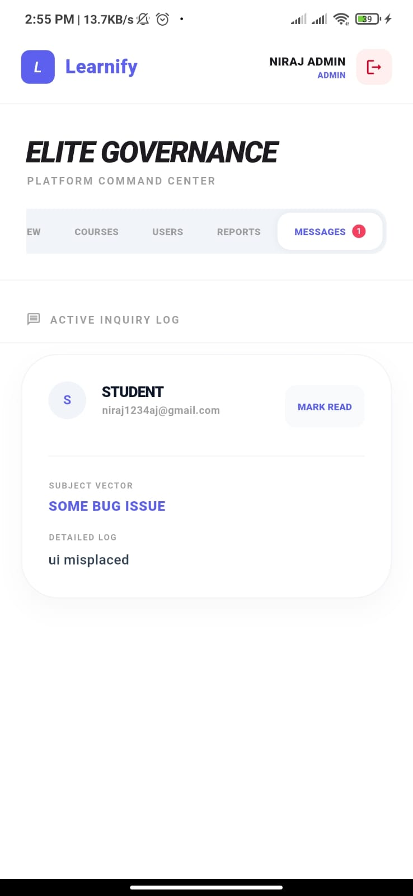
</p>

---

## ✨ Strategic Features

### 👤 Learner Capabilities
- **Neural Dashboard:** Dynamic pulse animations and daily protocols to track learning streaks.
- **Academic Registry:** Millions of technical topics dynamically fetched from the global cloud.
- **High-Density Study:** Modular curriculum structure with rich text, technical diagrams, and professional HTML rendering.
- **Persistent Progress:** Real-time synchronization of module completion (0-100%) to **Cloud Firestore**.
- **Sentiment Signal:** Star-based rating and feedback system for every curriculum node.
- **Smart Identity:** Dynamic 2D character avatars (Notion-style) that change based on user identity.

### 🏛️ Administrative Governance
- **Platform Command Center:** Real-time overview of total learners, enrollments, and support inquiries.
- **Registry Moderation:** Ability to toggle course visibility (Seen/Unseen) across the platform instantly.
- **User Management:** Full directory access with the power to **Restrict** or **Unblock** learner terminals.
- **Security Protocols:** Centralized log for course reports and content issues submitted by students.
- **Message Terminal:** Integrated inbox to process student support inquiries with notification badges.

---

## 🔐 Admin Access (For Evaluation)
To access the Governance Suite, select the **Admin** toggle on the Login Screen:
- **Identity:** `nirajaj133@gmail.com`
- **Access Key:** `Team6go`

---

## 🚀 Tech Stack
- **Frontend:** Flutter (Dart)
- **Backend:** Firebase Auth & Cloud Firestore (NoSQL)
- **Networking:** Wikipedia REST API (Action v1)
- **State Management:** Real-time Streams & SharedPreferences
- **UI Architecture:** Responsive layouts with custom "Notionists" 2D assets.

---

## 🛠️ Installation & Setup

1. **Clone the Repository:**
   ```bash
   git clone https://github.com/nirajaj/Team6-Excelerate-Project.git

2. **Initialize Dependencies:**
   ```bash
   flutter pub get

3. **Configure Firebase:**
   Ensure google-services.json (Android) and GoogleService-Info.plist (iOS) are placed in the correct directories.

4. **Execute Application:**
   ```bash
   flutter run
Developed by Team 6  | Excelerate Internship Project - 2024
